# Member Profile Service

Spring Boot와 AWS를 활용하여 팀원 정보를 관리하는 REST API 서비스입니다.

로컬에서는 H2 Database를 사용하여 개발하고, 운영 환경에서는 MySQL(RDS)을 사용할 수 있도록 Profile을 분리하였습니다.

또한 AWS EC2에 애플리케이션을 배포하여 외부에서도 API에 접근할 수 있도록 구성하였습니다.

---

# 기술 스택

## Backend

- Java 17
- Spring Boot 4.0.7
- Spring Web
- Spring Data JPA
- Spring Validation
- Spring Boot Actuator

## Database

- H2 Database (Local)
- MySQL (Prod)

## Cloud

- AWS EC2
- AWS VPC
- AWS Internet Gateway
- AWS Route Table
- AWS Security Group
- AWS Budget

## Build Tool

- Gradle

---

# 프로젝트 구조

```text
member-profile-service
├── docs
│   └── images
├── src
│   ├── main
│   │   ├── java
│   │   │   └── com.sparta.memberprofileservice
│   │   │       ├── global
│   │   │       │   └── exception
│   │   │       └── member
│   │   │           ├── controller
│   │   │           ├── dto
│   │   │           ├── entity
│   │   │           ├── repository
│   │   │           └── service
│   │   └── resources
│   │       ├── application.yaml
│   │       ├── application-local.yaml
│   │       └── application-prod.yaml
└── README.md
```

---

# LV0. AWS Budget 설정

## 목표

클라우드 실습 중 발생할 수 있는 예상치 못한 비용을 방지하기 위해 AWS Budget을 설정하였다.

---

## 구현 내용

- 월 예산을 100 USD로 설정
- 실제 비용이 80%에 도달하면 이메일 알림 전송
- 비용을 지속적으로 모니터링할 수 있도록 구성

---

## 왜 Budget을 먼저 설정하는가?

AWS는 사용한 만큼 비용이 발생하는 과금 방식(Pay-as-you-go)이다.

EC2, RDS, NAT Gateway 등의 리소스를 실수로 계속 실행하면 예상보다 많은 비용이 발생할 수 있다.

Budget을 먼저 설정하면 일정 금액 이상 사용 시 즉시 알림을 받아 불필요한 비용을 예방할 수 있다.

---

## 처리 흐름

```text
AWS 리소스 사용

↓

AWS Budget 비용 모니터링

↓

80% 도달

↓

이메일 알림

↓

비용 확인 및 리소스 점검
```

---

## 스크린샷

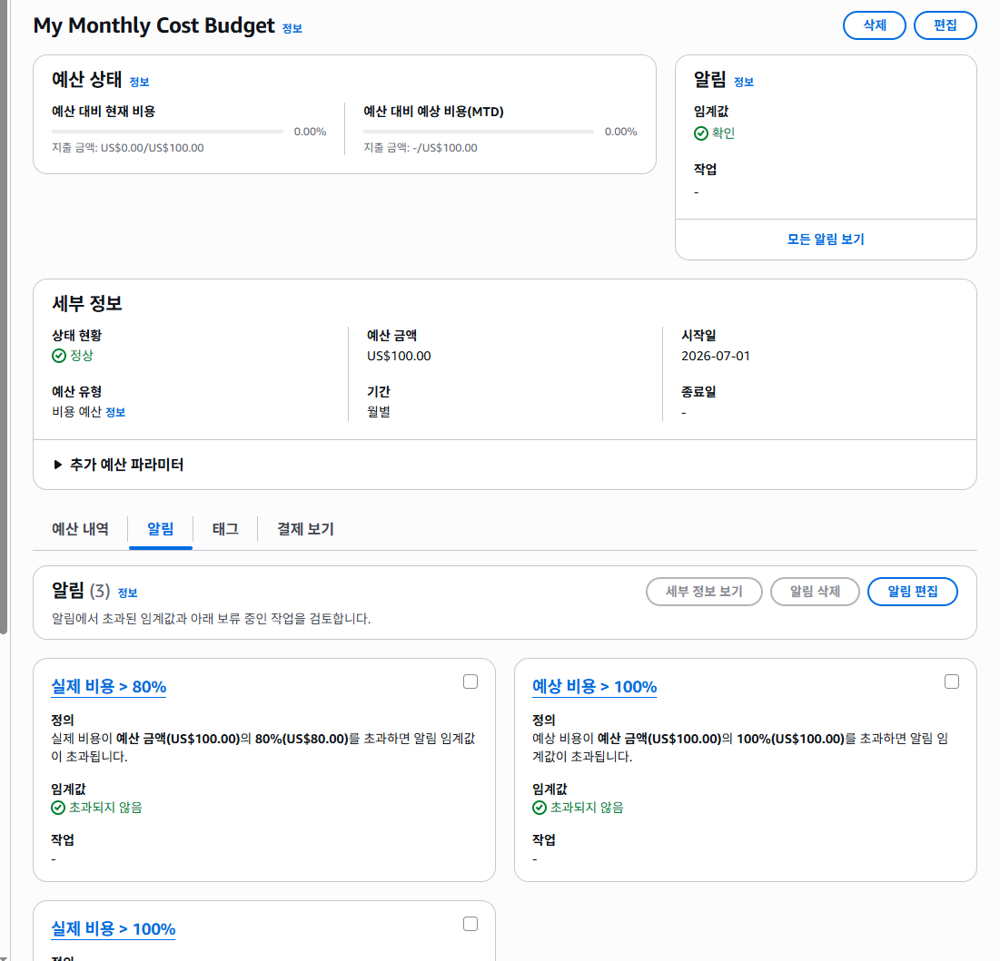

---

# LV1. 네트워크 구축 및 핵심 기능 배포

## 목표

Spring Boot 애플리케이션을 AWS EC2에서 실행하기 위한 네트워크 환경을 직접 구축하고, 외부에서 Health Check가 가능하도록 배포 환경을 구성하였다.

---
## 구현 내용

- VPC 생성
- Public / Private Subnet 분리
- Internet Gateway 생성 및 연결
- Public Route Table 생성
- Public Subnet 연결
- Public IPv4 자동 할당 활성화
- Security Group 생성
- EC2 생성
- Spring Boot 배포
- Actuator Health Check 확인

---
## 1. VPC 생성

### 구현 내용

- `member-profile-vpc` 생성
- IPv4 CIDR : `10.10.0.0/16`
- Default VPC를 사용하지 않고 과제 전용 VPC를 직접 생성

---

### 왜 VPC를 사용하는가?

VPC(Virtual Private Cloud)는 AWS 안에서 사용하는 나만의 가상 네트워크이다.

EC2, RDS, Subnet과 같은 AWS 리소스는 반드시 VPC 내부에서 동작한다.

즉, VPC는 AWS 인프라를 구성하기 위한 가장 기본이 되는 네트워크 공간이다.

이번 과제에서는 강의 실습에서 사용했던 VPC와 분리하기 위해 과제 전용 VPC를 새롭게 생성하였다.

---

### 처리 흐름

```text
AWS

↓

VPC 생성

↓

Private Network 확보

↓

Subnet 생성 준비
```

---

### 스크린샷

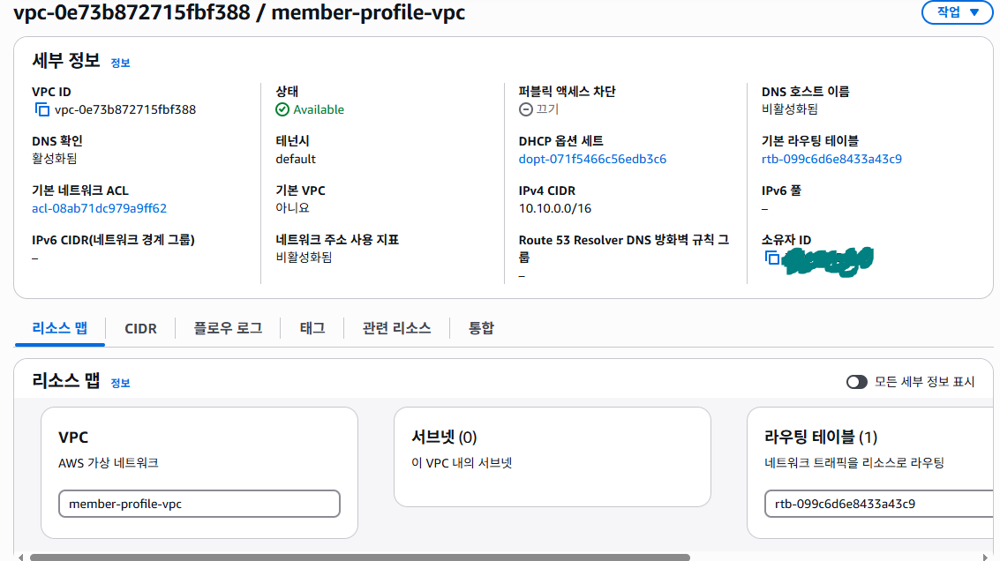

---

## 2. Public / Private Subnet 생성

### 구현 내용

VPC 내부를 두 개의 네트워크 영역으로 분리하였다.

- Public Subnet
    - `10.10.1.0/24`

- Private Subnet
    - `10.10.2.0/24`

---

### 왜 Public과 Private을 분리하는가?

하나의 네트워크 안에 모든 서버를 두는 것보다, 역할에 따라 네트워크를 분리하면 보안성이 높아진다.

- Public Subnet
    - 인터넷과 직접 통신하는 서버(EC2)

- Private Subnet
    - 외부에서 직접 접근하면 안 되는 서버(RDS 등)

현재 LV1에서는 EC2만 Public Subnet에서 사용하며, Private Subnet은 이후 RDS 구축을 위해 미리 생성하였다.

---

### 처리 흐름

```text
VPC

↓

Subnet 분리

↓

Public

↓

EC2

↓

Private

↓

RDS(예정)
```

---

### 스크린샷

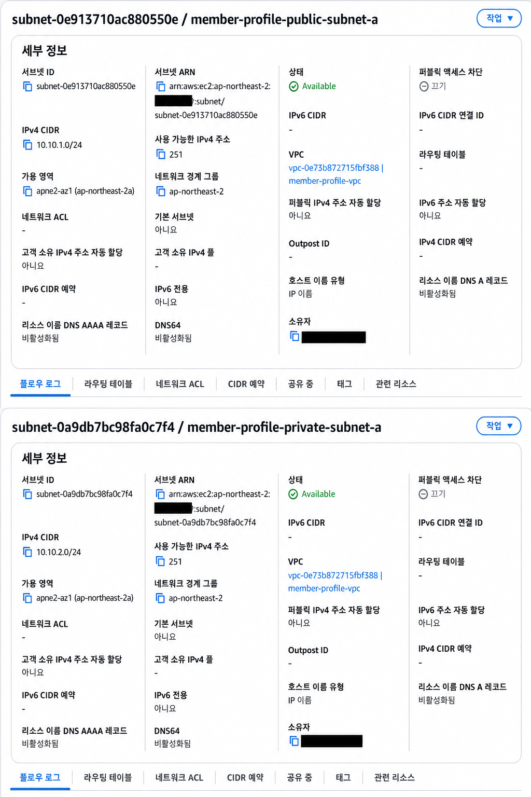

---

## 3. Internet Gateway 생성

### 구현 내용

- `member-profile-igw` 생성
- `member-profile-vpc`에 연결

---

### 왜 Internet Gateway를 사용하는가?

Internet Gateway는 VPC와 인터넷을 연결하는 출입구 역할을 한다.

Internet Gateway가 없으면 EC2를 생성하더라도 외부 인터넷과 통신할 수 없다.

즉, VPC 내부와 인터넷을 연결하는 첫 번째 구성 요소이다.

---

### 처리 흐름

```text
Internet

↓

Internet Gateway

↓

VPC
```

---

### 스크린샷

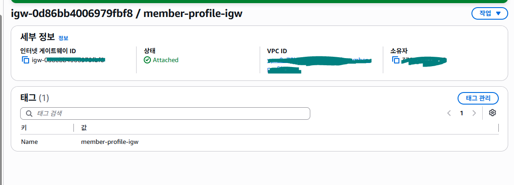

---

## 4. Public Route Table 생성

### 구현 내용

- Public Route Table 생성
- `0.0.0.0/0` → Internet Gateway 연결
- Public Subnet 연결

---

### 왜 Route Table을 사용하는가?

Route Table은 네트워크 트래픽이 어떤 경로로 이동할지 결정하는 규칙이다.

이번 과제에서는 모든 외부 요청(`0.0.0.0/0`)을 Internet Gateway로 전달하도록 설정하였다.

또한 해당 Route Table을 Public Subnet과 연결하여 Public Subnet이 실제 인터넷과 통신할 수 있도록 구성하였다.

---

### 처리 흐름

```text
Public Subnet

↓

Route Table

↓

Internet Gateway

↓

Internet
```

---

### Route Table

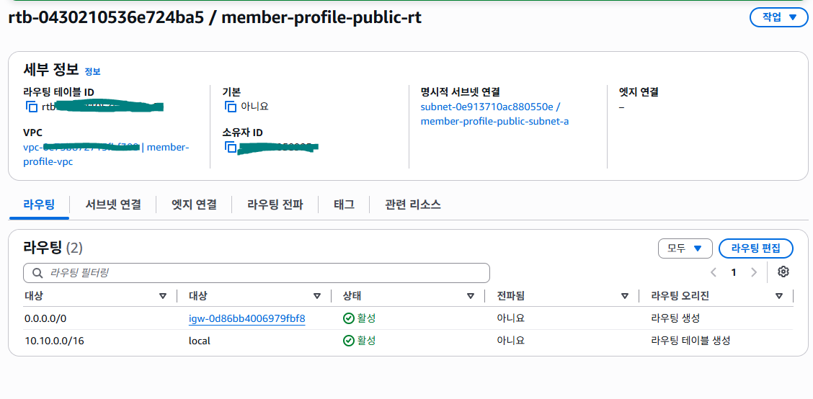

---

### Public Subnet 연결

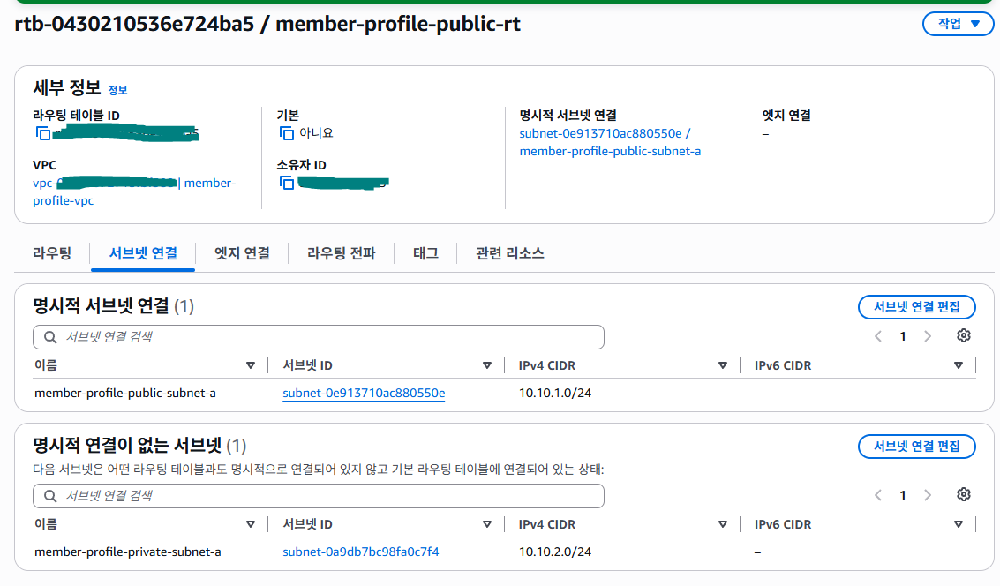

---

## 5. Public IPv4 자동 할당

### 구현 내용

Public Subnet에서 생성되는 EC2가 자동으로 Public IPv4를 할당받도록 설정하였다.

---

### 왜 Public IPv4 자동 할당을 사용하는가?

Public Subnet이라고 해서 자동으로 외부 접속이 가능한 것은 아니다.

EC2가 외부와 직접 통신하기 위해서는 Public IPv4 주소가 필요하다.

자동 할당을 활성화하면 해당 Subnet에서 생성되는 EC2는 Public IP를 자동으로 할당받아 인터넷과 통신할 수 있다.

---

### 처리 흐름

```text
EC2 생성

↓

Public IPv4 자동 할당

↓

Internet 접근 가능
```

---

### 스크린샷

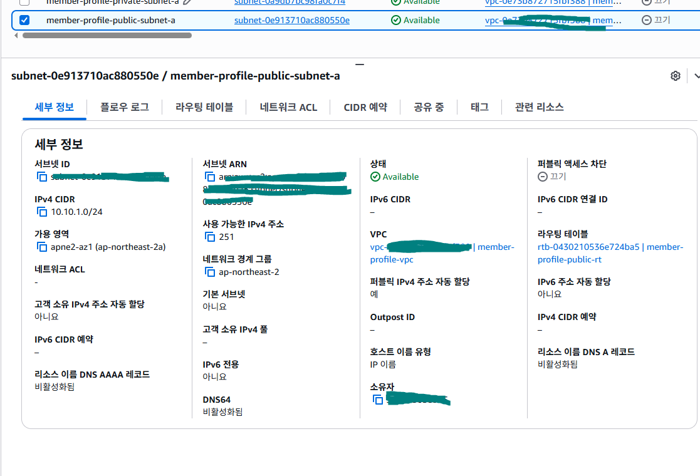

---

## 6. Security Group 생성

### 구현 내용

EC2 인스턴스에 적용할 보안 그룹(`member-profile-ec2-sg`)을 생성하였다.

인바운드 규칙은 다음과 같이 설정하였다.

- SSH(22) : 내 PC의 공인 IP만 허용
- Spring Boot(8080) : 모든 IPv4(0.0.0.0/0) 허용

아웃바운드 규칙은 기본값인 모든 트래픽 허용을 유지하였다.

---

### 왜 Security Group을 사용하는가?

Security Group은 EC2 인스턴스 앞에서 동작하는 가상 방화벽이다.

허용한 포트만 인스턴스로 접근할 수 있으며, 허용되지 않은 요청은 차단된다.

이번 프로젝트에서는 SSH 접속은 개발자인 본인만 가능하도록 제한하고, Spring Boot 애플리케이션은 외부에서 접속하여 테스트할 수 있도록 8080 포트를 개방하였다.

---

### 처리 흐름

```text
외부 요청

↓

Security Group

├── TCP 22
│      ↓
│   내 PC만 허용
│
└── TCP 8080
       ↓
Spring Boot
```

---

### 스크린샷


---

## 7. EC2 생성

### 구현 내용

Spring Boot 애플리케이션을 실행하기 위한 EC2 인스턴스를 생성하였다.

설정 내용은 다음과 같다.

- Amazon Linux 2023
- Java 17 (Amazon Corretto)
- t3.micro
- Public Subnet
- Security Group 연결
- Public IPv4 자동 할당

또한 SSH를 이용하여 EC2에 접속한 후 Java 17을 설치하였다.

---

### 왜 EC2를 사용하는가?

EC2는 AWS에서 제공하는 가상 서버이다.

기존에는 Spring Boot를 내 컴퓨터(localhost)에서만 실행했지만, EC2를 사용하면 인터넷을 통해 누구나 서버에 접속할 수 있다.

즉, 로컬 환경이 아닌 실제 클라우드 환경에서 애플리케이션을 운영할 수 있게 된다.

---

### 처리 흐름

```text
EC2 생성

↓

Java 설치

↓

Spring Boot 실행

↓

외부 접속 가능
```

---

### 스크린샷

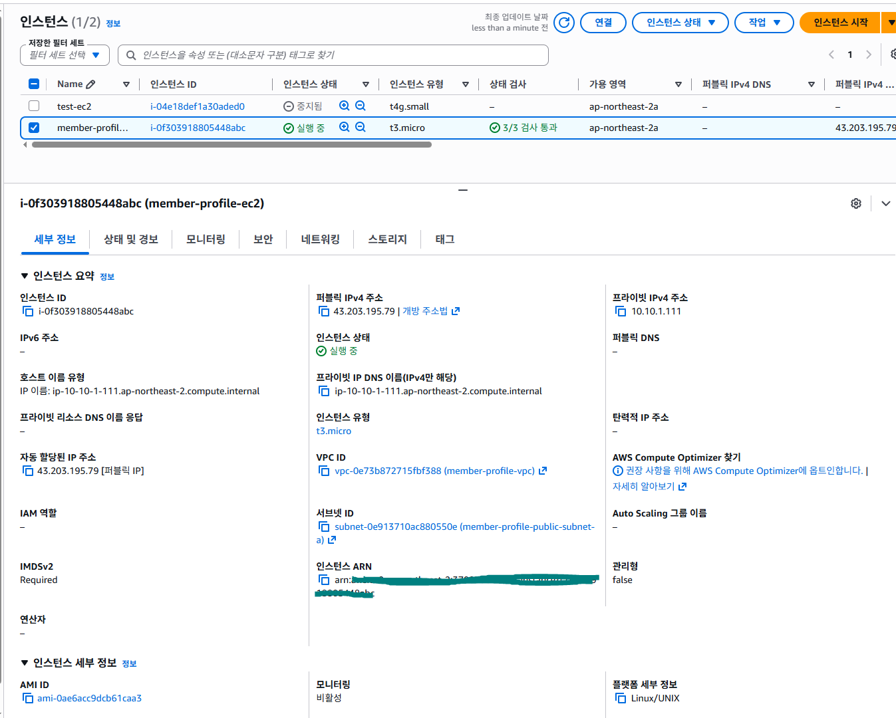

---

## 8. Spring Boot 배포

### 구현 내용

로컬에서 Gradle을 이용하여 실행 가능한 JAR 파일을 생성하였다.

생성된 JAR 파일을 SCP를 이용하여 EC2로 전송한 뒤 SSH로 접속하여 실행하였다.

---

### 왜 JAR 파일을 사용하는가?

Spring Boot 프로젝트는 실행 가능한 하나의 JAR 파일로 패키징할 수 있다.

이 JAR 파일 하나만 EC2에 업로드하면 Spring Boot 애플리케이션을 실행할 수 있다.

즉, 개발 환경과 운영 환경에서 동일한 실행 파일을 사용할 수 있다는 장점이 있다.

---

### 처리 흐름

```text
Spring Boot

↓

Gradle Build

↓

Executable JAR

↓

EC2 업로드

↓

Java 실행
```

---

## 9. Actuator Health Check

### 구현 내용

Spring Boot Actuator를 추가하고 `/actuator/health` 엔드포인트를 외부에 노출하였다.

EC2에 배포한 이후 Public IP를 통해 Health Check를 수행하여 정상적으로 서비스가 실행 중임을 확인하였다.

---

### 왜 Health Check를 사용하는가?

운영 중인 서버가 정상적으로 동작하는지 가장 빠르게 확인할 수 있는 기능이다.

Load Balancer나 Auto Scaling과 같은 AWS 서비스에서도 Health Check를 이용하여 서버의 정상 여부를 판단한다.

즉, 운영 환경에서 가장 기본이 되는 모니터링 기능이다.

---

### 처리 흐름

```text
브라우저

↓

EC2 Public IP

↓

Spring Boot

↓

Actuator

↓

Status : UP
```

---

### Health Check URL

```text
http://3.38.107.217:8080/actuator/health
```

> EC2를 중지(Stop) 후 다시 시작(Start)하면 Public IPv4 주소가 변경될 수 있다.

---

### 스크린샷

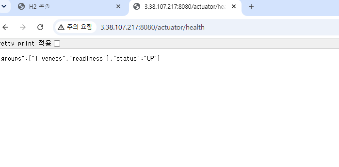

---

# LV1 전체 네트워크 구조

```text
                    Internet
                        │
                Internet Gateway
                        │
                Public Route Table
                        │
        ┌───────────────┴───────────────┐
        │                               │
Public Subnet                    Private Subnet
10.10.1.0/24                     10.10.2.0/24
        │
        │
     EC2 (Spring Boot)
```

---

# 레벨 1 단계에서 배운 점

- VPC는 AWS에서 사용하는 가상 네트워크 공간이라는 것을 이해하였다.
- Public Subnet과 Private Subnet의 역할 차이를 이해하였다.
- Internet Gateway와 Route Table이 함께 구성되어야 인터넷 통신이 가능하다는 것을 이해하였다.
- Security Group을 통해 필요한 포트만 허용하여 보안을 강화할 수 있다는 것을 배웠다.
- EC2에 Spring Boot를 직접 배포하고 외부에서 접속하는 과정을 경험하였다.
- Actuator를 이용하여 운영 중인 서버의 상태를 확인하는 방법을 학습하였다.

---
# API 명세

| Method | URI | Description |
|---------|-----|-------------|
| POST | /api/members | 팀원 등록 |
| GET | /api/members/{id} | 팀원 단건 조회 |
| GET | /actuator/health | 애플리케이션 상태 확인 |

---
# 실행 방법

## 프로젝트 실행

### 1. 프로젝트 빌드

```bash
./gradlew clean build
```

### 2. 애플리케이션 실행

```bash
java -jar build/libs/member-profile-service-0.0.1-SNAPSHOT.jar
```

### 3. 로컬 실행

```bash
./gradlew bootRun
```

---
# LV2. DB 분리 및 보안 연결

## 목표

로컬 H2 Database에서 테스트한 애플리케이션을 실제 운영 환경에 배포하기 위해 MySQL RDS를 구축하고, 데이터베이스 접속 정보를 AWS Systems Manager Parameter Store에서 안전하게 관리하였다.

또한 EC2에 IAM Role을 연결하여 Parameter Store 값을 조회할 수 있도록 구성하고, 조회한 값을 환경변수로 주입하여 Spring Boot 애플리케이션이 RDS에 연결되도록 구현하였다.

마지막으로 Parameter Store에 저장한 `team-name` 값이 `/actuator/info` 엔드포인트에서 정상적으로 출력되는지 확인하였다.

---

## 구현 내용

- Public Subnet B 생성
- DB Subnet Group 생성
- MySQL RDS 생성
- RDS 전용 Security Group 생성
- 로컬 PC에서 RDS 접속 테스트
- 로컬 접속용 임시 IP 규칙 삭제
- Parameter Store에 DB 접속 정보 저장
- EC2용 IAM Role 생성 및 연결
- Parameter Store 값을 환경변수로 주입
- Spring Boot 운영 프로파일로 RDS 연결
- Actuator Info 엔드포인트 검증

---

## 1. Public Subnet B 생성

### 구현 내용

RDS를 생성하기 위해 기존 Public Subnet A와 다른 가용 영역에 Public Subnet B를 추가하였다.

설정값은 다음과 같다.

- 이름: `member-profile-public-subnet-b`
- 가용 영역: `ap-northeast-2b`
- IPv4 CIDR: `10.10.3.0/24`
- Public IPv4 자동 할당: 활성화
- Route Table: `member-profile-public-rt`

---

### 왜 Public Subnet을 두 개 사용하는가?

RDS의 DB Subnet Group은 서로 다른 가용 영역에 속한 Subnet을 최소 두 개 포함해야 한다.

이번 과제에서는 로컬 PC에서 RDS 접속 테스트가 가능해야 했기 때문에, 기존 Public Subnet A와 새로 만든 Public Subnet B를 DB Subnet Group에 포함하였다.

```text
Public Subnet A
- ap-northeast-2a
- 10.10.1.0/24

Public Subnet B
- ap-northeast-2b
- 10.10.3.0/24
```

---

### 처리 흐름

```text
member-profile-vpc

↓

Public Subnet A
ap-northeast-2a

+

Public Subnet B
ap-northeast-2b

↓

DB Subnet Group 생성 준비
```

---

### 스크린샷

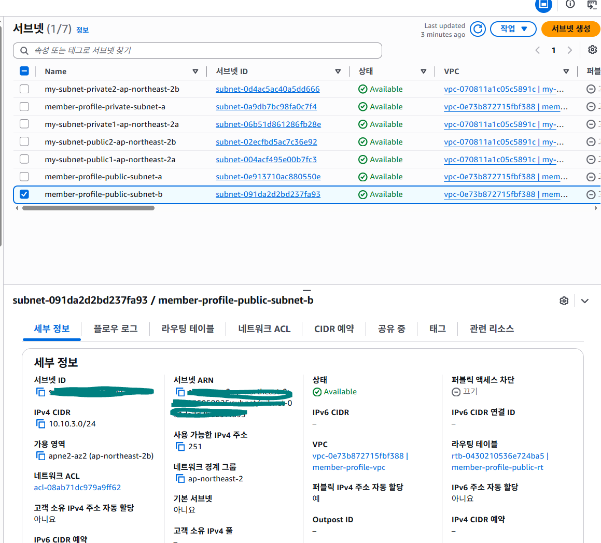

---

## 2. DB Subnet Group 생성

### 구현 내용

RDS가 배치될 수 있는 네트워크 범위를 지정하기 위해 DB Subnet Group을 생성하였다.

- 이름: `member-profile-db-subnet-group`
- VPC: `member-profile-vpc`
- 포함된 Subnet
  - `member-profile-public-subnet-a`
  - `member-profile-public-subnet-b`

---

### 왜 DB Subnet Group을 사용하는가?

RDS는 단일 Subnet을 직접 선택하는 방식이 아니라, 여러 Subnet을 하나의 DB Subnet Group으로 묶어 사용한다.

AWS는 DB Subnet Group에 포함된 Subnet 가운데 적절한 위치를 선택하여 RDS를 배치한다.

이번 구성에서는 서로 다른 두 가용 영역의 Public Subnet을 하나의 그룹으로 묶어 RDS 생성 조건을 만족하였다.

---

### 처리 흐름

```text
Public Subnet A
ap-northeast-2a

+

Public Subnet B
ap-northeast-2b

↓

member-profile-db-subnet-group

↓

RDS 배치 가능 영역 구성
```

---

### 스크린샷

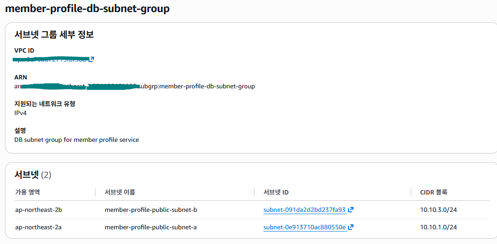

---

## 3. RDS Security Group 생성

### 구현 내용

MySQL RDS에 적용할 전용 Security Group을 생성하였다.

- 이름: `member-profile-rds-sg`
- VPC: `member-profile-vpc`
- 프로토콜: TCP
- 포트: `3306`

최종 인바운드 규칙의 소스에는 IP 주소를 사용하지 않고, LV1에서 생성한 EC2 Security Group ID만 지정하였다.

```text
MySQL/Aurora
TCP
3306
Source: member-profile-ec2-sg
```

---

### 왜 EC2 Security Group을 소스로 사용하는가?

RDS 인바운드 규칙에 `0.0.0.0/0` 또는 특정 IP 주소를 등록하면 불필요하게 접근 범위가 넓어진다.

대신 EC2 Security Group을 소스로 지정하면, 해당 Security Group이 연결된 EC2 인스턴스만 RDS의 3306 포트에 접근할 수 있다.

즉, IP 주소가 바뀌더라도 EC2와 RDS 사이의 연결 관계는 유지된다.

---

### 처리 흐름

```text
외부 사용자

↓

EC2 Security Group

↓

EC2 Spring Boot

↓

RDS Security Group
Source: EC2 Security Group ID

↓

MySQL RDS
```

---

### 초기 Security Group 구성

로컬 PC에서 DBeaver 접속 테스트를 진행하기 위해 내 공인 IP를 임시로 추가하였다.

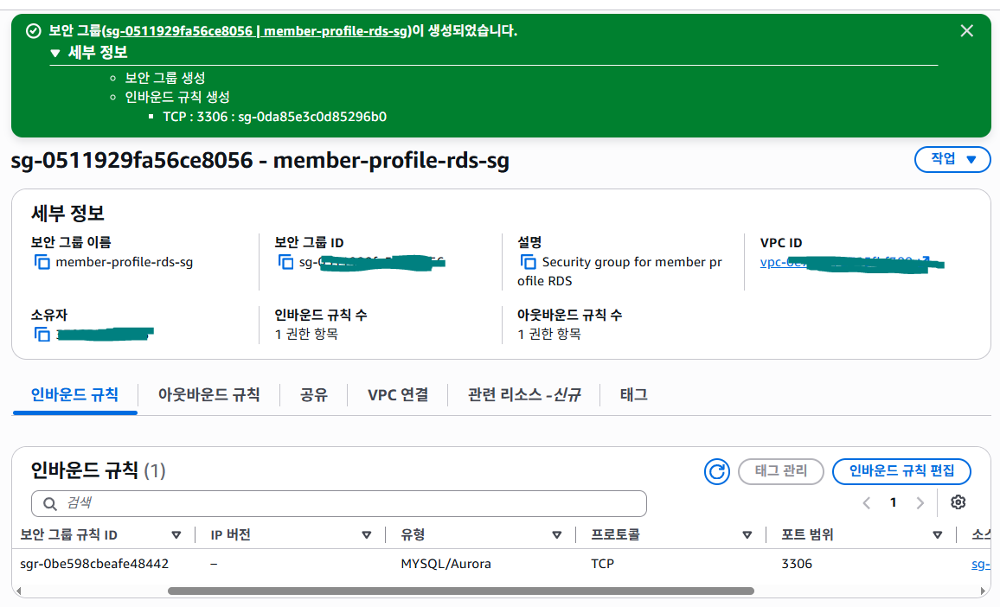

---

## 4. 로컬 접속 테스트 후 최종 Security Group 정리

### 구현 내용

RDS 생성 후 DBeaver에서 다음 정보를 사용해 접속 테스트를 진행하였다.

```text
Host: RDS Endpoint
Port: 3306
Database: member_profile
Username: admin
Password: RDS 마스터 암호
```

접속 후 아래 SQL을 실행하여 현재 연결된 데이터베이스를 확인하였다.

```sql
SELECT DATABASE();
```

실행 결과:

```text
member_profile
```

로컬 PC에서 RDS 연결이 정상적으로 이루어진 것을 확인한 뒤, 테스트를 위해 임시로 추가했던 내 IP 인바운드 규칙을 삭제하였다.

최종적으로는 EC2 Security Group ID만 남도록 구성하였다.

---

### 왜 임시 IP 규칙을 삭제했는가?

로컬 접속 테스트를 위해 추가한 내 IP 규칙은 검증이 끝난 이후에는 필요하지 않다.

과제 제출 요구사항에서도 RDS 인바운드 소스에 IP 주소가 아닌 EC2 Security Group ID가 등록되어 있어야 한다고 명시되어 있다.

따라서 최종 상태에서는 다음 규칙만 남겼다.

```text
MySQL/Aurora
TCP
3306
Source: sg-...
```

---

### 스크린샷

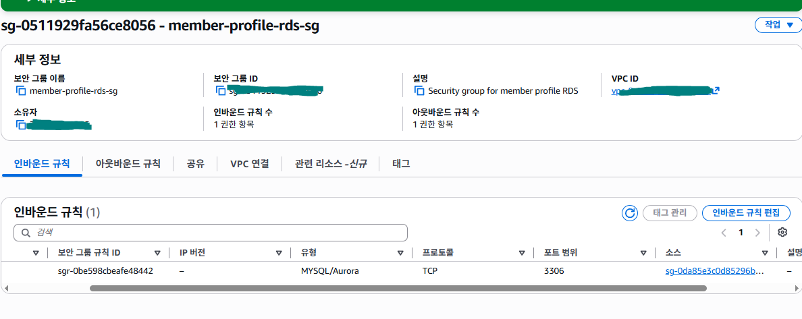

---

## 5. Parameter Store 구성

### 구현 내용

애플리케이션에서 사용할 데이터베이스 접속 정보를 코드에 작성하지 않기 위해 AWS Systems Manager Parameter Store를 구성하였다.

생성한 파라미터는 다음과 같다.

| Parameter | 유형 | 설명 |
|-----------|------|------|
| `/member-profile/prod/db-url` | String | RDS JDBC URL |
| `/member-profile/prod/db-username` | String | DB 사용자 계정 |
| `/member-profile/prod/db-password` | SecureString | DB 비밀번호 |
| `/member-profile/prod/team-name` | String | Actuator Info 확인용 값 |

---

### 왜 Parameter Store를 사용하는가?

운영 환경에서는 데이터베이스 URL이나 비밀번호를 GitHub 또는 소스 코드에 직접 작성하면 안 된다.

Parameter Store를 사용하면 민감한 정보를 AWS에서 중앙 관리할 수 있으며, 애플리케이션은 실행 시 필요한 값만 안전하게 전달받을 수 있다.

특히 DB 비밀번호는 `SecureString`으로 저장하여 암호화하였다.

---

### 처리 흐름

```text
Parameter Store

├── db-url
├── db-username
├── db-password
└── team-name

↓

EC2에서 조회
```

---

## 6. IAM Role 생성 및 EC2 연결

### 구현 내용

EC2가 Parameter Store를 조회할 수 있도록 IAM Role을 생성하고 인스턴스에 연결하였다.

설정 내용은 다음과 같다.

- Role 이름
  - `member-profile-ec2-role`

- 신뢰할 서비스
  - EC2

- 권한
  - `AmazonSSMReadOnlyAccess`

생성한 Role을 `member-profile-ec2` 인스턴스에 연결하였다.

---

### 왜 IAM Role을 사용하는가?

EC2가 AWS 서비스(Parameter Store)에 접근하기 위해서는 권한이 필요하다.

Access Key를 직접 서버에 저장하는 방식은 보안상 권장되지 않는다.

IAM Role을 사용하면 EC2 인스턴스가 필요한 권한만 안전하게 부여받아 Parameter Store를 조회할 수 있다.

---

### 처리 흐름

```text
EC2

↓

IAM Role

↓

AmazonSSMReadOnlyAccess

↓

Parameter Store 조회 가능
```

---

## 7. Spring Boot와 Parameter Store 연동

### 구현 내용

운영 환경에서는 Spring Boot가 Parameter Store를 직접 조회하지 않도록 구성하였다.

대신 EC2가 IAM Role 권한으로 Parameter Store 값을 조회한 뒤, 환경변수로 등록하여 Spring Boot를 실행하도록 구성하였다.

`application-prod.yaml`

```yaml
spring:
  datasource:
    url: ${DB_URL}
    username: ${DB_USERNAME}
    password: ${DB_PASSWORD}

info:
  team:
    name: ${TEAM_NAME}
```

---

### 왜 환경변수 방식으로 구성했는가?

Spring Boot 4.0.7에서는 Spring Cloud AWS와의 호환성을 고려해야 한다.

이번 프로젝트에서는 Spring Cloud AWS 라이브러리를 사용하지 않고,

EC2에서 Parameter Store 값을 조회하여 환경변수로 전달하는 방식을 사용하였다.

이 방식의 장점은 다음과 같다.

- Spring Boot 버전에 영향을 받지 않는다.
- 데이터베이스 접속 정보를 코드에 작성하지 않는다.
- IAM Role만으로 안전하게 값을 조회할 수 있다.
- Spring Boot는 일반적인 환경변수만 사용하므로 구조가 단순하다.

---

### 동작 흐름

```text
Parameter Store

↓

IAM Role

↓

AWS CLI

↓

환경변수(export)

↓

Spring Boot (prod)

↓

MySQL RDS

↓

Application 실행
```

실행 시 EC2에서 다음과 같은 흐름으로 애플리케이션을 실행하였다.

```text
Parameter Store 조회

↓

DB_URL
DB_USERNAME
DB_PASSWORD
TEAM_NAME

↓

export

↓

java -jar

↓

Spring Boot 실행
```

즉, Spring Boot가 Parameter Store를 직접 조회하는 것이 아니라,

EC2가 Parameter Store 값을 환경변수로 주입하고, Spring Boot는 `${DB_URL}` 형태로 해당 값을 사용하는 구조이다.

---

## 8. Actuator Info 검증

### 구현 내용

Parameter Store에 저장한 `team-name` 값이 Spring Boot까지 정상적으로 전달되는지 확인하기 위해 `/actuator/info` 엔드포인트를 검증하였다.

검증 결과 다음과 같이 Parameter Store의 값이 정상적으로 출력되는 것을 확인하였다.

URL

```text
http://43.202.50.119:8080/actuator/info
```

결과

```json
{
  "team": {
    "name": "cat-team"
  }
}
```

EC2를 Stop 후 다시 Start하면 Public IPv4 주소가 변경될 수 있으므로 URL도 함께 변경될 수 있다.

---

### 스크린샷

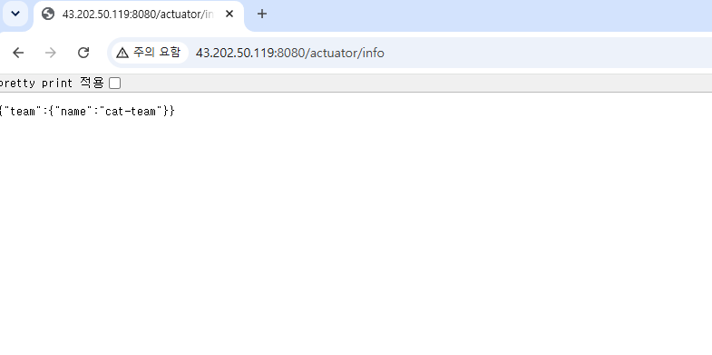

---

# 구현 결과

- Public Subnet을 두 개의 Availability Zone에 구성하여 RDS 생성 조건을 만족하였다.
- DB Subnet Group을 구성하여 RDS가 사용할 네트워크 환경을 구축하였다.
- MySQL RDS를 생성하고 EC2와 Security Group을 통해 안전하게 연결하였다.
- Parameter Store를 이용하여 DB 접속 정보를 코드가 아닌 AWS에서 관리하도록 구성하였다.
- EC2 IAM Role을 이용하여 Parameter Store를 안전하게 조회하도록 구성하였다.
- Spring Boot 운영 환경(prod)에서 Parameter Store 값을 환경변수로 주입하여 RDS와 정상적으로 연결하였다.
- `/actuator/info`를 통해 Parameter Store의 `team-name` 값이 정상적으로 출력되는 것을 확인하였다.

---

# LV2 전체 동작 흐름

```text
                Parameter Store
      ┌────────────┼────────────┐
      │            │            │
   DB_URL     DB_USERNAME   DB_PASSWORD
      │            │            │
      └────────────┼────────────┘
                   │
             TEAM_NAME
                   │
                   ▼
             IAM Role (EC2)
                   │
                   ▼
               AWS CLI
                   │
          환경변수(export)
                   │
                   ▼
     Spring Boot (Profile = prod)
                   │
          ┌────────┴────────┐
          │                 │
          ▼                 ▼
      MySQL RDS      /actuator/info
                           │
                           ▼
                       cat-team
```

---

# 검증 결과

| 검증 항목 | 결과 |
|-----------|------|
| RDS 생성 | ✅ |
| DB Subnet Group 구성 | ✅ |
| Security Group 연결 | ✅ |
| DBeaver 로컬 접속 | ✅ |
| Parameter Store 생성 | ✅ |
| IAM Role 연결 | ✅ |
| Spring Boot → RDS 연결 | ✅ |
| `/actuator/info` 출력 | ✅ |

---

# API 명세

| Method | URI | Description |
|---------|-----|-------------|
| POST | `/api/members` | 팀원 등록 |
| GET | `/api/members/{id}` | 팀원 단건 조회 |
| GET | `/actuator/health` | 애플리케이션 상태 확인 |
| GET | `/actuator/info` | Parameter Store(team-name) 확인 |

---

# 실행 방법

## 1. 프로젝트 빌드

```bash
./gradlew clean build
```

---

## 2. EC2로 JAR 전송

```bash
scp -i ~/.ssh/member-profile-key.pem \
build/libs/member-profile-service-0.0.1-SNAPSHOT.jar \
ec2-user@{EC2_PUBLIC_IP}:~
```

---

## 3. Parameter Store 값을 환경변수로 등록

```bash
export DB_URL=...
export DB_USERNAME=...
export DB_PASSWORD=...
export TEAM_NAME=...
```

---

## 4. Spring Boot 실행

```bash
java -Dspring.profiles.active=prod \
     -jar member-profile-service-0.0.1-SNAPSHOT.jar
```

---

## 5. Actuator 확인

Health Check

```text
http://{EC2_PUBLIC_IP}:8080/actuator/health
```

Info

```text
http://{EC2_PUBLIC_IP}:8080/actuator/info
```

---

# 레벨 2 단계에서 배운 점

- RDS는 DB Subnet Group을 통해 여러 Subnet을 하나의 그룹으로 구성하여 배포된다는 것을 이해하였다.
- Security Group은 IP 주소 대신 다른 Security Group을 허용하여 EC2와 RDS를 안전하게 연결할 수 있다는 것을 학습하였다.
- Parameter Store를 이용하면 데이터베이스 접속 정보를 코드에 작성하지 않고 안전하게 관리할 수 있다는 것을 이해하였다.
- IAM Role을 통해 Access Key 없이도 EC2가 AWS 서비스를 사용할 수 있다는 것을 학습하였다.
- Spring Boot가 Parameter Store를 직접 조회하는 것이 아니라, EC2가 IAM Role 권한으로 Parameter Store 값을 조회하여 환경변수로 전달하고 Spring Boot가 이를 사용하는 구조를 이해하였다.
- `/actuator/info`를 이용하여 운영 환경의 설정값이 정상적으로 주입되었는지 검증하는 방법을 학습하였다.